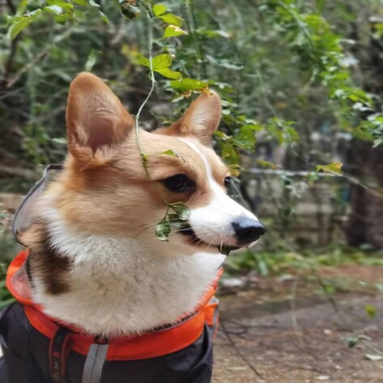
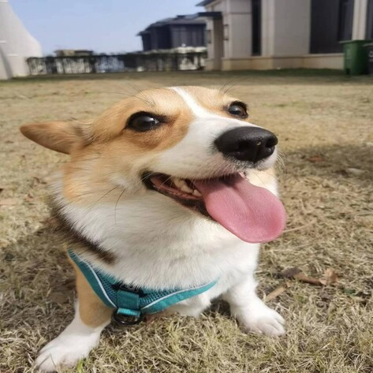
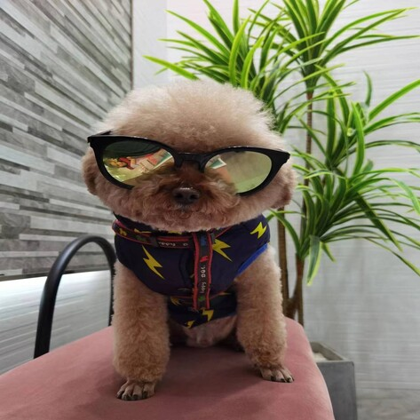
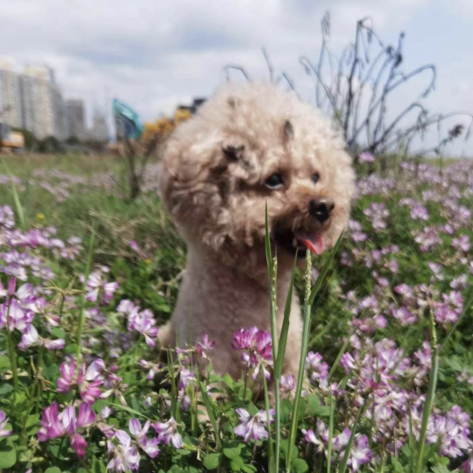

I love playing drums🥁 (of course - as a drummer), playing basketball🏀, hiking🏃, playing Nintendo Swith🎮, watching Janpanese Anime, and more.

This page captures some fun facts about me.

### Drum Learning 🥁

While I'm certainly a fan of Deep Learning, it's Drum Learning that really gets me in a spin - there's just something about nailing a drum solo that even the smartest AI can't quite beat!

Below is me practicing with Dave Bruck's Take Five:

<iframe width="560" height="315" src="https://drive.google.com/file/d/11R97eNhqTX3bNrVXfBkKmSNe_hETaeXJ/preview" title="Drum Learning" frameborder="0" allow="accelerometer; autoplay; clipboard-write; encrypted-media; gyroscope; picture-in-picture; web-share" allowfullscreen></iframe>

### Music Listening 🎵

Here are My Top 3 Favorite Jazz Piece

<table>
  <thead>
    <tr>
      <th>Song</th>
      <th>Author</th>
      <th>Cover</th>
      <th>Comments</th>
    </tr>
  </thead>
  <tbody>
        <tr>
      <td><strong><a href="https://www.youtube.com/watch?v=_Fm10whccto">Birdland</a></strong></td>
      <td>Weather Report</td>
      <td style="padding:2.5%;width:25%;vertical-align:middle;min-width:120px">
        
      </td>
      <td>I love "Birdland" for its exceptional drumming, providing a rhythmic backbone that blends explosive energy with gentle releases, capturing the essence of city life through a transition from mellow tones to a lively big band sound.</td>
    </tr>
    <tr>
      <td><strong><a href="https://www.youtube.com/watch?v=1Nz9bq-3mfc">And Then I Knew</a></strong></td>
      <td>Pat Metheny</td>
      <td style="padding:2.5%;width:25%;vertical-align:middle;min-width:120px">
        
      </td>
      <td>In Pat Metheny's "And Then I Knew," subtle percussion enhances the track's airy ambiance, with light cymbal brushes and delicate hi-hat strokes complementing Metheny's style, creating a dreamy, emotionally deep soundscape.</td>
    </tr>
    <tr>
      <td><strong><a href="https://www.youtube.com/watch?v=cb2w2m1JmCY">Take the A Train</a></strong></td>
      <td>Duke Ellington</td>
      <td style="padding:2.5%;width:25%;vertical-align:middle;min-width:120px">
        
      </td>
      <td>"Take the A Train" by Duke Ellington features vibrant swing rhythm percussion, with crisp cymbal work and a dynamic brass and reed interplay, epitomizing the energy and elegance of the jazz age.</td>
    </tr>
  </tbody>
</table>

### Dog Learning 🐕

Move over music, because Dog Learning steals the show in my life, led by my furry maestros, Coca and Cola! These two aren't just pets, they're tail-wagging, bark-singing conductors of daily fun. Whether they're in a synchronized treat-snatching routine or performing a barking duet at the mailman, every day with Coca and Cola is like a lively, paws-tapping musical!

Below, you'll find six cute pictures about Coca and Cola. Hover your mouse over them to take a peek, or if you're on your phone, just give them a tap to see the fun unfold.

    

        
    

    

        
    

    

        
    

    

        
    

    

        
    

    

        
    

