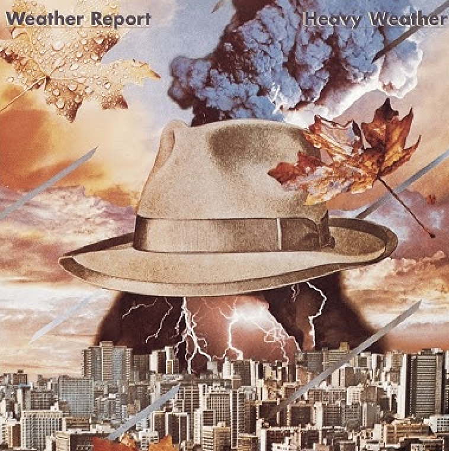
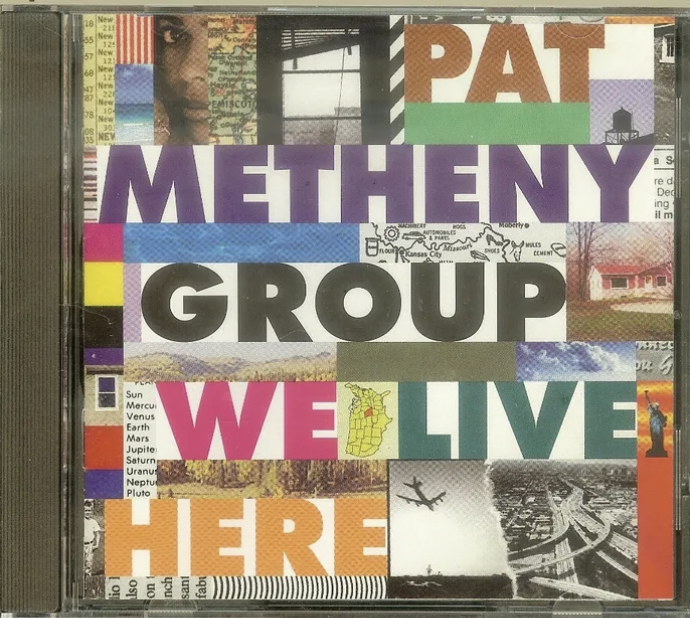
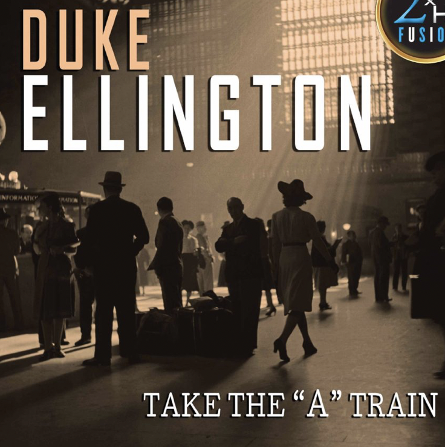

Beyond academics, I love playing drums🥁, playing basketball🏀, hiking🏃, playing Nintendo Swith🎮, watching Janpanese Anime, and more.

This page captures some fun facts about me.

### Drum Learning 🥁

While I'm certainly a fan of Deep Learning, it's Drum Learning that really gets me in a spin - there's just something about nailing a drum solo that even the smartest AI can't quite beat!

Below is me practicing with Dave Bruck's Take Five:

<iframe width="560" height="315" src="https://drive.google.com/file/d/11R97eNhqTX3bNrVXfBkKmSNe_hETaeXJ/preview" title="Drum Learning" frameborder="0" allow="accelerometer; autoplay; clipboard-write; encrypted-media; gyroscope; picture-in-picture; web-share" allowfullscreen></iframe>

### Dog Learning 🐕

Move over drumming, because Dog Learning steals the show in my life, led by my furry maestros, Coca and Cola! These two aren't just pets, they're tail-wagging, bark-singing conductors of daily fun. Whether they're in a synchronized treat-snatching routine or performing a barking duet at the mailman, every day with Coca and Cola is like a lively, paws-tapping musical!

Below, you'll find six hilarious memes about Coca and Cola. Hover your mouse over them to take a peek, or if you're on your phone, just give them a tap to see the fun unfold.

    

        
    

    

        
    

    

        
    

    

        
    

    

        
    

    

        
    

### Music Listening - My Top 3 Favorite Jazz Piece 🎵

<table>
  <thead>
    <tr>
      <th>Song</th>
      <th>Author</th>
      <th>Cover</th>
      <th>Youtube Link</th>
      <th>Comments</th>
    </tr>
  </thead>
  <tbody>
        <tr>
      <td><strong>Birdland</strong></td>
      <td>Weather Report</td>
      <td style="padding:2.5%;width:25%;vertical-align:middle;min-width:120px">
        
      </td>
      <th>https://www.youtube.com/watch?v=_Fm10whccto</th>
      <td>"Birdland" shines primarily due to its exceptional drumming and percussion, which serve as the song's rhythmic backbone. The interplay of hi-hat and side stick patterns provides a steady foundation, allowing other instruments to seamlessly integrate. The drumming not only supports but enhances the dynamics, skillfully balancing between explosive energy and gentle releases. This track feels like an urban jazz anthem, less about nightlife and more about the rhythm of the city. Its transition from a mellow, atmospheric tone to a lively big band sound captures the essence of city life. Particularly impressive is how the drumming weaves complex patterns without overwhelming the melody, adding depth and texture to the music. As the opening piece of the album and potentially for a jazz band's set, "Birdland" sets an adventurous tone, inviting the listener on a musical journey through the cityscape. The drumming, in essence, is not just a part of the song but the story's narrator, guiding us through this urban exploration."</td>
    </tr>
    <tr>
      <td><strong>And Then I Knew</strong></td>
      <td>Pat Metheny</td>
      <td style="padding:2.5%;width:25%;vertical-align:middle;min-width:120px">
        
      </td>
      <th>https://www.youtube.com/watch?v=1Nz9bq-3mfc</th>
      <td>In Pat Metheny's "And Then I Knew," the percussion plays a subtle yet pivotal role, enhancing the track's airy and contemplative ambiance. The use of light cymbal brushes, understated shaker sounds, and delicate hi-hat strokes contribute to the track's dreamy and expansive atmosphere. This restrained approach to percussion complements Metheny's signature style, adding depth without overpowering the melody. The composition flows seamlessly, with a narrative quality in its dynamics and progression. The interplay of guitar with the rhythm section creates an immersive listening experience, marked by moments of emotional depth and reflective calm. Overall, "And Then I Knew" showcases a masterful integration of subtle percussion with intricate musical arrangements, resulting in a piece that is both evocative and gracefully composed.</td>
    </tr>
    <tr>
      <td><strong>Take the A Train</strong></td>
      <td>Duke Ellington</td>
      <td style="padding:2.5%;width:25%;vertical-align:middle;min-width:120px">
        
      </td>
      <th>https://www.youtube.com/watch?v=cb2w2m1JmCY</th>
      <td>In Duke Ellington's "Take the A Train," the percussion is essential in setting the lively swing rhythm that defines the track. Focused on the ride cymbal, snare, and bass drum, the drumming provides a vibrant, steady beat that underpins the piece. The cymbal work is particularly notable for its crispness, adding a sparkling texture to the rhythm. Musically, the arrangement showcases Ellington's mastery. The iconic piano introduction paves the way for the horns, whose interplay creates a rich, dynamic sound. The brass and reed sections deliver a melody that's both rhythmic and harmonious, embodying the elegance and energy of the jazz age. The composition brilliantly balances individual instrument highlights with a cohesive overall progression, keeping the energy high and engaging. "Take the A Train" stands out as not just a song but an emblematic jazz experience, with its percussion capturing the quintessential spirit of the swing era.</td>
    </tr>
  </tbody>
</table>
