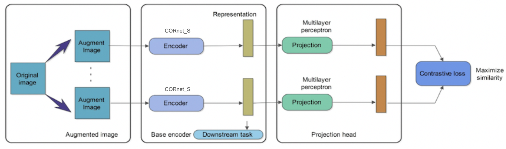
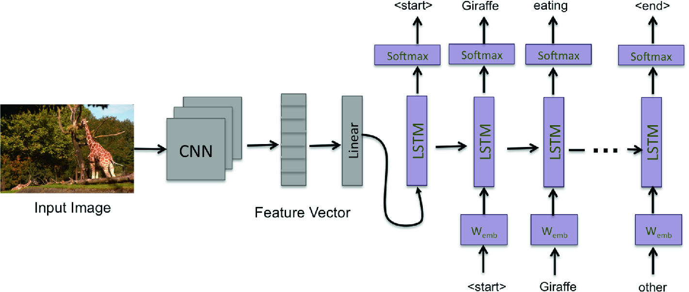
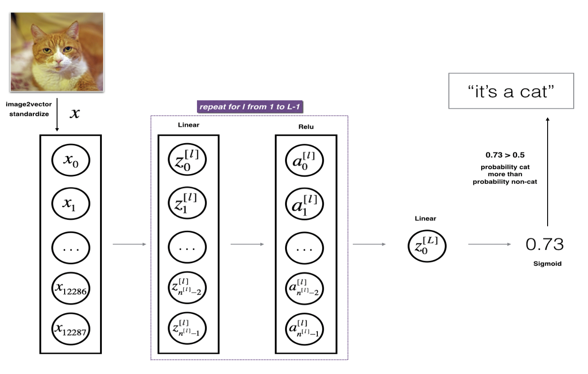
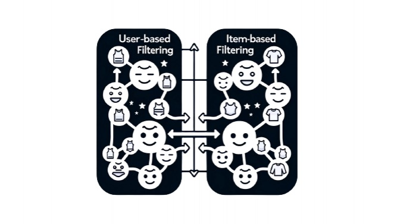
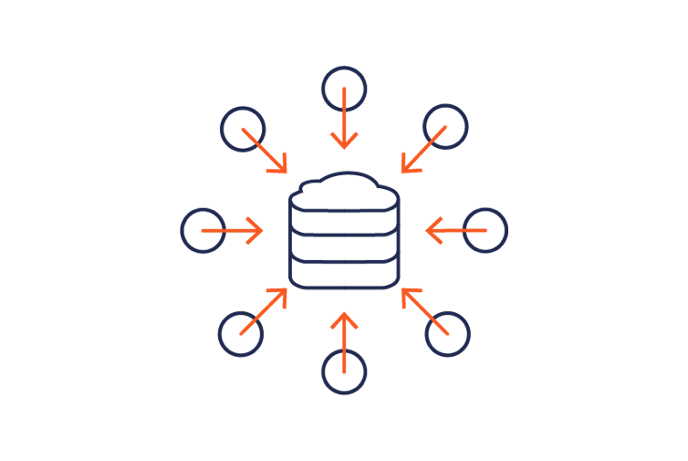
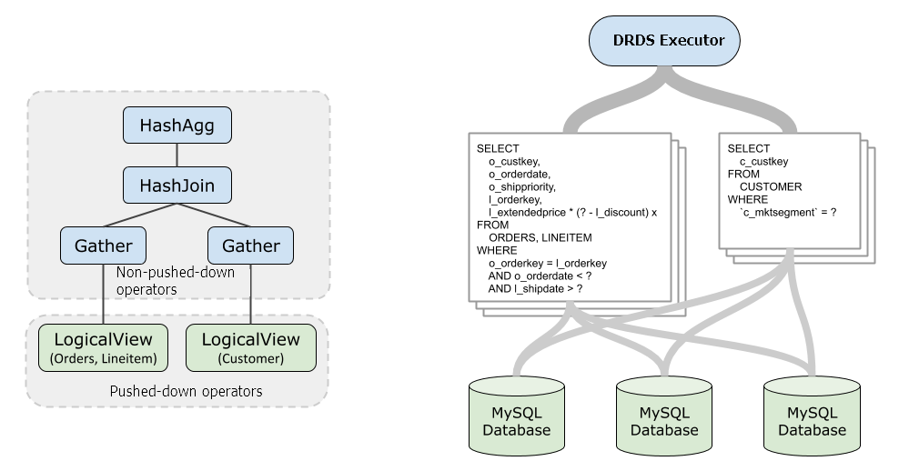
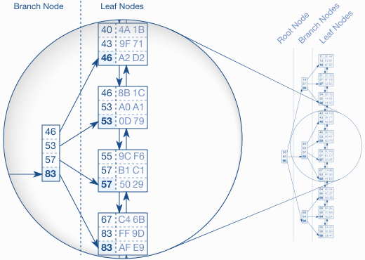
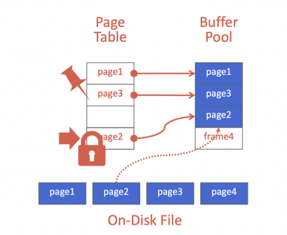
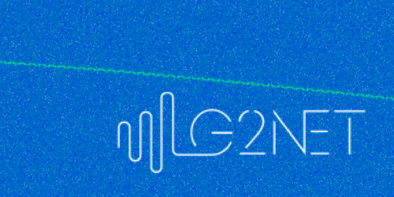

More unpublished/ongoing content to come!

## Research

<table style="width:100%;border:0px;border-spacing:0px;border-collapse:separate;margin-right:auto;margin-left:auto;">
  <tr>
    <td style="padding:2.5%;width:25%;vertical-align:middle;min-width:120px">
      
    </td>
    <td style="padding:2.5%;width:75%;vertical-align:middle">
      <h3>LPnet: Log Polar Transformed Cornet Encoder with SIMCLR Decoder for Scene Verification</h3>
      <strong>Yunfan Long</strong>
       
      <a href="https://docs.google.com/presentation/d/19ZmARbVpGQAUvkekOrDVXUlb_zu-uErg/edit?usp=sharing&ouid=107659118907272604893&rtpof=true&sd=true">slides</a> / <a href="https://github.com/yunfanlong/GURU-Research">code</a>
      
In this research prject, I develop and fine-tune LPnet, consisting of a log-polar-transformation-enhanced CORnet encoder and a SIMCLR decoder, for scene verification tasks in different visual angles. I implement DeepgazeII, IKN, and GBVS visual saliency algorithm to simulate human fixation pattern and investigate their performance difference. I also integrate an LSTM architecture in the final layer to incorporate saliency information from previous fixations. Evaluation is performed on the faces dataset, Imagenet dogs dataset, and Imagenet100 dataset with multiple rotations and scales to better understand how model performance is impacted by transformations to inputs at test time. Result shows that that LPnet outperforms euclidean CNN by 8% on average and demonstrates much better generalization at multiple rotations and scales, due to the partial invariance to scale and rotation granted by the log polar transform.

    </td>
  </tr>

  <tr>
    <td style="padding:2.5%;width:25%;vertical-align:middle;min-width:120px">
      
    </td>
    <td style="padding:2.5%;width:75%;vertical-align:middle">
      <h3>CGEN: Semi-Supervised NLP Powered Cohort Generation</h3>
      <strong>Yunfan Long</strong>
       
      <a href="https://github.com/yunfanlong/NLP-Cohort-Generation">code</a>
      
At UCSD Health, I explore the potential of Natural Language Processing (NLP) in streamlining the process of cohort generation from unstructured EHR data. I design an extraction pipeline using state-of-the-art unsupervised NLP models to automatically identify and categorize International Classification of Diseases (ICD) codes, drug names, and other relevant medical concepts. Automate data extraction, reduce manual curation efforts by 70%, and improve the efficiency of cohort generation processes by 50%. The current model achieves 82% accuracy in extracting medical concepts from diverse EHR sources.

      

    </td>
  </tr>
</table>

## Selective Projects

### AI/ML

<table style="width:100%;border:0px;border-spacing:0px;border-collapse:separate;margin-right:auto;margin-left:auto;">
  <tr>
    <td style="padding:2.5%;width:25%;vertical-align:middle;min-width:120px">
      
    </td>
    <td style="padding:2.5%;width:75%;vertical-align:middle">
      <h3>DL4Jazz: Exploration and Optimization of Bidirectional and VAE LSTM Networks for Jazz Music Generation</h3>
      <strong>Yunfan Long</strong>
       
      <a href="https://soundcloud.com/dl4jazz">soundcloud</a> / <a href="https://github.com/yunfanlong/DL4Jazz">code</a>
      
As a jazz enthusiast and a jazz band drummer, this is really my favorite project. This project is dedicated to go beyond vanilla LSTM to explore variants of LSTM-based jazz music generation models. I adapted the DeepJazz framework, including its preprocessing steps, grammar, and generation pipeline, along with specific input/output dimensions and selected hyperparameters. This approach facilitates a clear and direct comparison among diverse models. DL4Jazz utilized bi-LSTM and vae-LSTM models to learn and generate jazz. Just like its predecessor, deepjazz, DL4Jazz learns from an array of musical inputs to compose original jazz pieces.

    </td>
  </tr>

   <tr>
    <td style="padding:2.5%;width:25%;vertical-align:middle;min-width:120px">
      
    </td>
    <td style="padding:2.5%;width:75%;vertical-align:middle">
      <h3>Amazon Massive Intent Classification with Bert and SimCLR/SupContrast</h3>
      <strong>Yunfan Long</strong>, Dongze Li, Xiaoyan He
       
      <a href="https://github.com/yunfanlong/Bert-Massive-Intent-Classification/blob/main/Report_Bert_SIMCLR.pdf">report</a> / <a href="https://github.com/yunfanlong/Bert-Massive-Intent-Classification">code</a>
      
In this study, we explore the use of a pre-trained BERT model for categorizing user intent, using the Amazon Massive Intent dataset with 60 intent categories. We start with a pre-trained BERT model as an encoder, adding a classifier layer for final predictions. This baseline achieves a test accuracy of 88.9711%. By reducing the batch size to 16 and incorporating warm-up and Layer-wise Learning Rate Decay (LLRD), we enhance the model's performance, reaching a test accuracy of 90.0471%. We experiment with contrastive loss functions, specifically SimCLR and SupContrast. SimCLR, an unsupervised method, yields a lower test accuracy of 61.829%, as expected. SupContrast, closer to our baseline approach, achieves a comparable test accuracy of 88.1977%.

    </td>
  </tr>

  <tr>
    <td style="padding:2.5%;width:25%;vertical-align:middle;min-width:120px">
      
    </td>
    <td style="padding:2.5%;width:75%;vertical-align:middle">
      <h3>Automatic Image Captioning</h3>
      <strong>Yunfan Long</strong>, Dongze Li, Xiaoyan He
       
      <a href="https://github.com/yunfanlong/Automatic-Image-Captioning/blob/main/Report_CNN_LSTM.pdf">report</a> / <a href="https://github.com/yunfanlong/Automatic-Image-Captioning">code</a>
      
In this study, we developed image captioning models for the COCO Image Captioning Task, utilizing a subset (1/5) of the dataset with five captions per image. We employed two architectures. 1. Custom Model: A combination of a custom CNN encoder and an LSTM decoder. After tuning the hidden and embedding sizes, it achieved a BLEU-1 score of 48.502, BLEU-4 score of 1.986, and a cross-entropy test loss of 1.508. 2.Pretrained Model: An integration of a pretrained Resnet-50 encoder and an LSTM decoder. Optimizing the optimizer and learning rate, this model reached a BLEU-1 score of 50.267, BLEU-4 score of 1.542, and a cross-entropy test loss of 2.308. Both models were evaluated using BLEU-1, BLEU-4 scores, and cross-entropy loss, with the second model slightly outperforming the first in BLEU-1 score.

    </td>
  </tr>

  <tr>
    <td style="padding:2.5%;width:25%;vertical-align:middle;min-width:120px">
      
    </td>
    <td style="padding:2.5%;width:75%;vertical-align:middle">
      <h3>From-Scratch Implementation, Optimization, and Evaluation of Multi-layer Neural Networks</h3>
      <strong>Yunfan Long</strong>, Dongze Li, Xiaoyan He
       
      <a href="https://github.com/yunfanlong/Multi-Layer-NN/blob/main/Report_NN.pdf">report</a> / <a href="https://github.com/yunfanlong/Multi-Layer-NN">code</a>
      
In this study, we implemented the multi-layer neural network from scratch to classify images from different classes in CIFAR-10 dataset. We used softmax function as the activation function for output layer. In our original model, we used one hidden layer with 128 hidden units, and chose tanh function as the activation for hidden layer with learning rate as 0.00001, batch size as 128, momentum gamma as 0.9 with no regularization. We applied stochastic gradient descent in all parts of our experiment. With our original model, we reached the test accuracy of 47.36%. Then, in other parts of experiment, we tried L1 and L2 regularization, and also tried to use other activation function(ReLU & Sigmoid) for hidden units and change the number of hidden units and hidden layers. We achieved 50.77% as our highest test accuracy with ReLU activation for hidden units.

    </td>
  </tr>

  <tr>
    <td style="padding:2.5%;width:25%;vertical-align:middle;min-width:120px">
      
    </td>
    <td style="padding:2.5%;width:75%;vertical-align:middle">
      <h3>Cloth Recommender System</h3>
      <strong>Yunfan Long</strong>, Muchan Li
       
      <a href="../assets/pdfs/cloth_recommend.pdf">report</a>
      
In this project, we first performed exploratory data analysis on RentTheRunway datasets. We then implemented various types of recommendation system models to recommend cloths to users, predict ratings based on sentiment analysis, and predict cloth categories.

    </td>
  </tr>
</table>

### Database Implementation
<table style="width:100%;border:0px;border-spacing:0px;border-collapse:separate;margin-right:auto;margin-left:auto;">

  <tr>
    <td style="padding:2.5%;width:25%;vertical-align:middle;min-width:120px">
      
    </td>
    <td style="padding:2.5%;width:75%;vertical-align:middle">
      <h3>Database Concurrency Controller</h3>
      <strong>Yunfan Long</strong>
       
      <a href="https://github.com/yunfanlong/Bustub-Concurrency-Control/blob/main/report.md">report</a> / <a href="https://github.com/yunfanlong/Bustub-Concurrency-Control/tree/main">code</a>
      
In this project, I implement the lock manager in bustub, which is responsible for tracking tuple-level locks used in the database so that the database supports concurrent query plan execution. A two-phase locking strategy is used to implement specific tuple-level locks. The specific locking and unlocking strategy should be determined by the isolation level of the transaction. When a transaction needs to read or write a tuple, it needs to try to obtain the read lock or write lock corresponding to the tuple according to the isolation level, and release it at the appropriate moment.

    </td>
  </tr>

  <tr>
    <td style="padding:2.5%;width:25%;vertical-align:middle;min-width:120px">
      
    </td>
    <td style="padding:2.5%;width:75%;vertical-align:middle">
      <h3>Database Query Plan Executor</h3>
      <strong>Yunfan Long</strong>
       
      <a href="https://github.com/yunfanlong/Bustub-Query-Plan-Execution/blob/main/src/report.md">report</a> / <a href="https://github.com/yunfanlong/Bustub-Query-Plan-Execution/tree/main">code</a>
      
In relational databases, SQL statements are transformed into logical query plans, and after query optimization, they are converted into physical query plans. The system completes the corresponding statement functions by executing these physical query plans. In this experiment, I implement the physical query plan execution functions for bustub, including sequential scan, insertion, deletion, update, join, aggregation, as well as DISTINCT and LIMIT.

    </td>
  </tr>

 <tr>
    <td style="padding:2.5%;width:25%;vertical-align:middle;min-width:120px">
      
    </td>
    <td style="padding:2.5%;width:75%;vertical-align:middle">
      <h3>Database BTree Index</h3>
      <strong>Yunfan Long</strong>, Muchan Li
       
      <a href="https://github.com/yunfanlong/BadgerDB-B-Tree-Index">code</a>
      
In this programming project, we implement a B+Tree index in our database system. A B+Tree is a balanced search tree in which the internal pages direct the search and leaf pages contain the actual data entries. The index provides fast data retrieval without needing to search every row in a database table, enabling rapid random lookups and efficient scans of ordered records. Our implementation support thread-safe search, insertion, deletion (including splitting and merging nodes), and an iterator to support in-order leaf scans.

    </td>
  </tr>

  <tr>
    <td style="padding:2.5%;width:25%;vertical-align:middle;min-width:120px">
      
    </td>
    <td style="padding:2.5%;width:75%;vertical-align:middle">
      <h3>Database Buffer Manager</h3>
      <strong>Yunfan Long</strong>
       
      <a href="https://github.com/yunfanlong/BadgerDB-Buffer-Manager">code</a>
      
In this project, I build a disk-oriented storage manager for the Badger DBMS. I implement Extendible Hash Table, LRU-K Replacement Policy, and Buffer Pool Manager Instance. Such a storage manager assumes that the primary storage location of the database is on disk. The project is to implement a buffer pool in my storage manager. The buffer pool is responsible for moving physical pages back and forth from main memory to disk. It allows a DBMS to support databases that are larger than the amount of memory that is available to the system. The buffer pool's operations are transparent to other parts in the system. For example, the system asks the buffer pool for a page using its unique identifier (page_id_t) and it does not know whether that page is already in memory or whether the system has to go retrieve it from disk.

    </td>
  </tr>
</table>

## Competitions

<table style="width:100%;border:0px;border-spacing:0px;border-collapse:separate;margin-right:auto;margin-left:auto;">
  <tr>
    <td style="padding:2.5%;width:25%;vertical-align:middle;min-width:120px">
      
    </td>
    <td style="padding:2.5%;width:75%;vertical-align:middle">
      <h3>Kaggle G2Net Gravitational Wave Detection Competition: Silver Medal</h3>
      <strong>Yunfan Long</strong>
       
      <a href="https://www.kaggle.com/yunfanlong">profile</a> / <a href="https://github.com/yunfanlong/Kaggle-G2NET-Competition">code</a>
      
In this competition, I developed a model using TensorFlow to analyze simulated Gravitational Wave (GW) time-series data from an Earth-based detector network. This involved the innovative application of Fourier transformation to convert the 1-D GW time series data into a 2-D frequency-domain format. Further enhancing the model's efficiency, I constructed a Constant-Q Transform (CQT) kernel and implemented mixed precision training, significantly reducing the training time. This approach led to a remarkable achievement: my model reached an accuracy of 87.8% in detecting gravitational waves, placing it in the top 5% among over a thousand competing teams. This work contributed to our understanding of cosmic phenomena, particularly in the areas of stellar-origin black holes and the expansion of the universe, showcasing my skills in data analysis and model development in a cutting-edge field of astrophysics.

    </td>
  </tr>

  <tr>
    <td style="padding:2.5%;width:25%;vertical-align:middle;min-width:120px">
      
    </td>
    <td style="padding:2.5%;width:75%;vertical-align:middle">
      <h3>USA Computing Olympiad: Platinum Contestant</h3>
      <strong>Yunfan Long</strong>
       
      <a href="http://www.usaco.org/current/data/feb21_gold_results.html">result</a>
      
Top 500 contestants in the US

    </td>
  </tr>
</table>