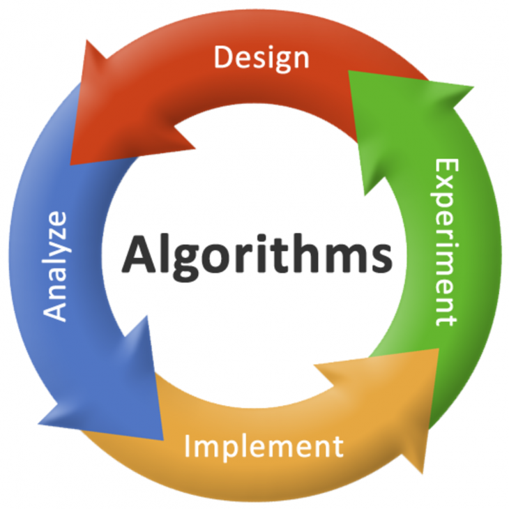

Below is a comprehensive list detailing the classes for which I served as an undergraduate teaching assistant at UCSD. Instructors are listed in the order in which I worked with them. Where available, instructor evaluations are attached.

My responsibilities:

- Automated the grading process by developing test cases and grading systems in Python, Java, and Stata. Deployed the autograder using Docker on AWS EC2 instances, specifically through Gradescope.
- Assisted over 1,200 students by conducting regular technical office hours, creating and grading assignments and exams, and overseeing the class forum and logistics.
- Guided and mentored new staff, equipping them with the managerial and technical skills required to excel as course assistants.

<!-- ### Teaching by Department
{: .no_toc .text-delta }

1. TOC
{:toc} -->

#### Computer Science and Engineering

<table style="width:100%;border:0px;border-spacing:0px;border-collapse:separate;margin-right:auto;margin-left:auto;">

<tr>
    <td style="padding:2.5%;width:25%;vertical-align:middle;min-width:120px">
    
    </td>
    <td style="padding:2.5%;width:75%;vertical-align:middle">
    <h3>AI: Neural Networks/Pattern Recognition</h3>
     
    Prof. Garrison Cottrell
     
    <em>UCSD CSE 251B WI24</em>
     

    <a href="../assets/pdfs/CSE_151B251B_syllabus_w24.pdf">syllabus</a>
    
    

    
This course covers Hopfield networks, application to optimization problems layered perceptrons, recurrent networks, and unsupervised learning. Programming exercises explore model behavior with a final project or exam on a cognitive science, artificial intelligence, or optimization problem of the student’s choice.

    </td>
</tr>

<tr>
    <td style="padding:2.5%;width:25%;vertical-align:middle;min-width:120px">
    
    </td>
    <td style="padding:2.5%;width:75%;vertical-align:middle">
    <h3> Deep Learning </h3>
     
    Prof. Garrison Cottrell
     
    <em>UCSD CSE 151B WI24</em>
     

    <a href="../assets/pdfs/CSE_151B251B_syllabus_w24.pdf">syllabus</a>
    
    

    
This course covers the fundamentals of neural networks. We introduce linear regression, logistic regression, perceptrons, multilayer networks and back-propagation, convolutional neural networks, recurrent networks, and deep networks trained by reinforcement learning.

    </td>
</tr>
</table>

#### Data Science

<table style="width:100%;border:0px;border-spacing:0px;border-collapse:separate;margin-right:auto;margin-left:auto;">

  <tr>
    <td style="padding:2.5%;width:25%;vertical-align:middle;min-width:120px">
      
    </td>
    <td style="padding:2.5%;width:75%;vertical-align:middle">
      <h3>Theoretical Foundations of Data Science II  (X4)</h3>
       
      Prof. Justin Eldridge, Yusu Wang, Akbar Rafiey
       
      <em>UCSD DSC 40B  FA22, WI23, SP23, FA23</em>
       
      
      
      <a href="../assets/pdfs/evaluations/dsc40b_eval.pdf">evaluation</a> / <a href="https://dsc40b.com">website</a>
      
      

      
DSC 40B, the second course in the DSC 40A-B sequence, covers the fundamentals of computer science with applications to data science. Topics include time complexity analysis, the analysis of recursive algorithms, graph theory, and graph search algorithms. Whereas other courses in the curriculum, such as DSC 20 and DSC 30, may touch on these topics briefly, this course aims to develop a deeper, theoretical understanding. DSC 40A-B connect to DSC 10, 20, and 30 by providing the theoretical foundation for the methods that underlie data science.

    </td>
  </tr>

  <tr>
    <td style="padding:2.5%;width:25%;vertical-align:middle;min-width:120px">
      
    </td>
    <td style="padding:2.5%;width:75%;vertical-align:middle">
      <h3>The Practice and Application of Data Science (X2)</h3>
       
      Prof. Justin Eldridge, Prof. Suraj Rampure
       
      <em>UCSD DSC 80  FA22, WI24</em>
       
      
      <a href="../assets/pdfs/evaluations/dsc80_eval.pdf">evaluation</a> / <a href="https://dsc-courses.github.io/dsc80-2023-wi/">website</a>
      
      

      
The marriage of data, computation, and inferential thinking, or “data science,” is redefining how people and organizations solve challenging problems and understand the world. This course bridges lower- and upper-division data science courses as well as methods courses in other fields. In DSC80, students master the data science life-cycle and learn many of the fundamental principles and techniques of data science spanning algorithms, statistics, machine learning, visualization, and data systems.

    </td>
  </tr>

</table>

